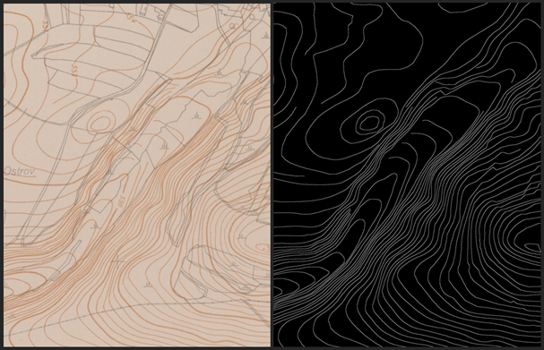

# Feature extraction in scanned maps using deep learning

## Abstract

This dissertation investigates the application of deep learning methods for automated feature extraction from historical topographic maps, addressing the problem of converting raster scans into vector data for modern GIS applications. Through three peer-reviewed publications, it demonstrates that convolutional neural networks, particularly U-Net, can effectively extract both area features (wetlands) and linear features (elevation contours) from Czech topographic maps while taking into account topological integrity. The research compares semantic segmentation and object detection approaches, develops a complete vectorization pipeline with topology-aware loss functions, and systematically analyzes how scanning quality parameters affect performance. Key findings establish that moderate scanning quality is sufficient for reliable extraction, bit depth has negligible impact on cartographic content, and the developed methods reduce manual labor substantially while producing outputs requiring minimal correction. The work provides evidence-based digitization guidelines and operational workflows deployable at institutional scales, establishing deep learning as a viable approach for automated historical map processing with applications in environmental science, landscape reconstruction, and cultural heritage preservation.

This repository was created to showcase the usecases explored in the thesis. The three papers comprising the dissertation are all represented here, wetland segmentation, elevation contour vectorization and impact of scanning quality on vectorization performance. Code, trained models and map excerpts for testing are included.
The code is based on (and forked) from Yizi Chen's benchmark. Big thanks to him and IGN.
The datasets are heavily limited by copyright, thus only a small part is made available for testing. 
Please note the wetland ArcGIS .dlpk models are too big to be stored on GitHub, and they are available upon request.

## Environment
The environment can be created with attached Dockerfile, which includes all dependencies.

```bat
docker build -t vectorization:latest .
docker run -it --gpus all -v /<local_folder>:/app vectorization:latest
```

To use BALoss, it needs to be compiled and installed first with:

```bat
cd loss/MBD_BAL/faster_MBD
python3 setup.py build
python3 install .
cd ../../../
```

- **Repository structure** 

This repository contains: 

```markdown
📂benchmark
 ┣ 📂data              # Dataset loader
 ┣ 📂dataset           # Datasets files including images and ground truths
   ┣ 📂Test            # Map excerpts for testing
   ┣ 📂Test_GT         # and their ground truth segmented maps for comparison
   ┣ 📂inferred_output # segmented results with accuracy metrics
 ┣ 📂evaluation        # Evaluation code for pixel and topology evaluation, also with vector overlay analysis
 ┣ 📂loss              # Pixel and topology losses
 ┣ 📂model             # Pytorch models
 ┣ 📂trained_models    # pre-trained segmentation models and ArcGIS vectorization pipelines
   ┣ 📂smo             # State map derived 1:5000
   ┣ 📂tm_quality      # Topographic maps TM10 and TM25 of various quality
 ┣ 📂training_info     # Training results, epochs, logs etc.
 ┣ inference.py        # main function for inferring new EPMs for vectorization
 ┣ train.py            # main function for training new models
 ```
train.py and inference.py can be launched with parameters and flags described at the bottom of respective files.

**Training** 
To train a contour vectorization model, create subfolders `/Train` and `/Val` in `/dataset`. Next, put there map images with .tif extension, the smart data loader can deal with multiple input maps. Along with them, include ground truth maps with the same name and `_GT.tif` suffix, and optionally also binary mask with `_mask.tif` suffix. The two (three) raster files need to have the same resolution. Edit `train.py` parameters to your liking and run it.


**Inference** 
To infer a model on an unseen map to create edge probability map (EPM), run `inference.py` with desired parameters, notably the path to the trained model. If pointed to the GT raster, the program also runs statistics (precision/recall/f1).
To vectorize the EPM, either use the pipeline from second paper included in `/trained_models/vectorization_models.atbx` in ArcGIS, or implement it elsewhere.

**Evaluation** 
To evaluate the vectorized .shp, run `/evaluation/evaluate_shp.py` with the GT .shp and set tolerance. This calculates overlay statistics and topological errors to properly compare performance of various models.